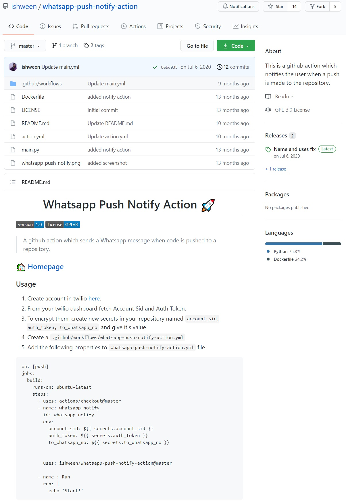
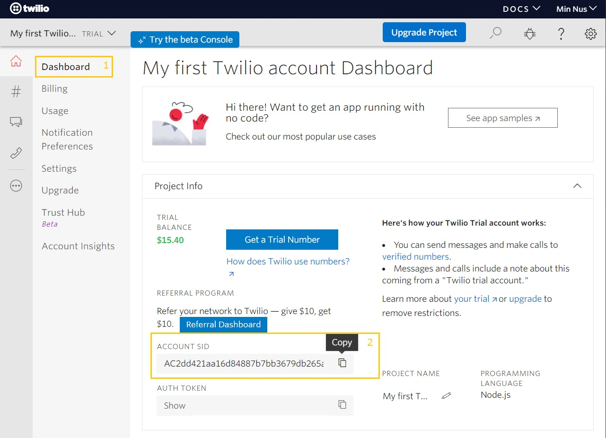
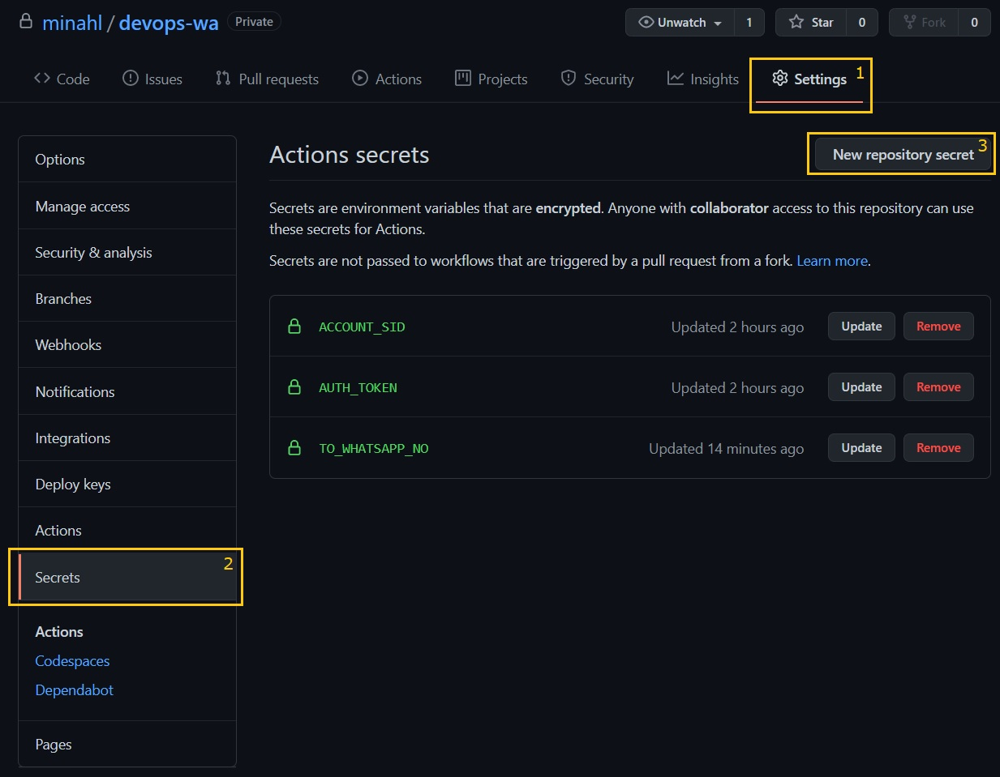
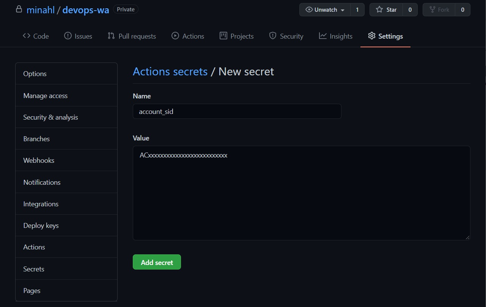
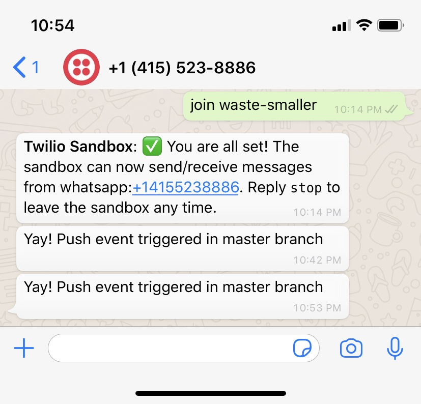

# devops-wa
Sending a WhatsApp (WA) message for GitHub push

# 1 Google is your best friend!
Since I don't use Telegram, I decided to see if there was something out there for Whatsapp 
Found this from GitHub user <a href="https://github.com/ishween/whatsapp-push-notify-action">ishween</a>

# 2 What is going on?
Looked through her repo files to make sense of things 
Twilio is needed, so I signed up and looked up a few more articles, namely: 
<a href="https://www.twilio.com/blog/send-whatsapp-message-30-seconds-python">Send Whatsapp Message</a> 
<a href="https://www.twilio.com/blog/how-to-send-whatsapp-media-messages-with-python">How to Send Whatsapp Media Messages</a>

# 3 I can do this?
I figure instead of using her code, I can try to do it myself. 
After 4 hours of failure, I am back to square 1, using her code. 
And it works.

# 4 Follow the instructions

 

Sign up for Twilio and create 3 secrets in GitHub repo 

 
 
 

Add a new file and commit changes 
Wait for new WhatsApp message! 

